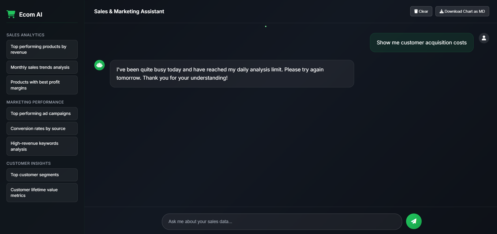

# E-commerce AI Data Agent



This project is a sophisticated AI-powered agent designed to answer natural language questions about e-commerce data. It features a modern, interactive web interface where users can ask questions, view data, and see visualizations in real-time.

## 🌟 Core Features

-   **Natural Language to SQL:** Utilizes Google's Gemini LLM to understand user questions and convert them into precise SQL queries.
-   **Interactive Data Visualization:** Automatically generates interactive charts using Plotly for query results that are suitable for visualization.
-   **Real-time Streaming:** Employs FastAPI's `StreamingResponse` to provide a live, "thinking" effect as the agent processes a request.
-   **Standalone Chart Downloads:** Allows users to download visualizations as self-contained HTML files for reporting and sharing.
-   **Modern UI/UX:** A sleek, dark-themed, and responsive user interface inspired by leading AI chat applications.

## 🛠️ Tech Stack

-   **Backend:** Python, FastAPI
-   **Database:** SQLite
-   **AI / LLM:** Google Gemini API (`gemini-1.5-flash-latest`)
-   **Data Handling:** Pandas, SQLAlchemy
-   **Visualization:** Plotly
-   **Frontend:** HTML, CSS, JavaScript

## 🚀 Getting Started

Follow these instructions to get a local copy up and running.

### Prerequisites

-   Python 3.10+
-   A Google Gemini API Key

### Installation

1.  **Clone the repository:**
    ```bash
    git clone https://github.com/YourUsername/ecommerce-data-agent.git
    cd ecommerce-data-agent
    ```

2.  **Create and activate a virtual environment:**
    *   On Windows:
        ```bash
        python -m venv venv
        .\venv\Scripts\activate
        ```
    *   On macOS/Linux:
        ```bash
        python3 -m venv venv
        source venv/bin/activate
        ```

3.  **Install the required packages:**
    ```bash
    pip install -r requirements.txt
    ```

4.  **Set up your environment variables:**
    *   Create a new file named `.env` in the root directory.
    *   Add your Google Gemini API key to this file:
        ```
        GOOGLE_API_KEY="YOUR_API_KEY_HERE"
        ```

5.  **Initialize the database:**
    *   The project comes with three CSV datasets in the `/data` directory.
    *   Run the setup script to create and populate the SQLite database:
        ```bash
        cd scripts
        python setup_database.py
        cd ..
        ```
    *   This will create an `ecommerce_data.db` file in the root directory.

### Running the Application

1.  **Start the FastAPI server with Uvicorn:**
    ```bash
    uvicorn app.main:app --reload
    ```

2.  **Access the application:**
    *   Open your web browser and go to **`http://127.0.0.1:8000`**.

## 📝 How It Works

The application follows a simple but powerful agentic loop:

1.  **Perceive:** The FastAPI backend receives a user's question from the web interface.
2.  **Think (Text-to-SQL):** The question is sent to the Gemini LLM, which is prompted to convert it into an SQL query based on the database schema.
3.  **Act (Query):** The generated SQL is executed against the local SQLite database.
4.  **Think (Visualization):** The query results are analyzed. If suitable (i.e., multiple rows and numeric data), an interactive Plotly chart is generated.
5.  **Act (Respond):** The final payload, containing the data answer, SQL query, and chart information, is streamed back to the user's browser for rendering.

## 💡 Example Questions

You can try asking the agent questions like:
-   "What is my total sales?"
-   "Calculate the RoAS"
-   "Which 5 products had the highest CPC?"
-   "Show me total ad sales by date"
-   "What are the top 5 products by ad spend?"

---

_This project was built as a demonstration of building modern, agentic AI systems._